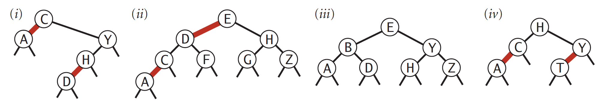
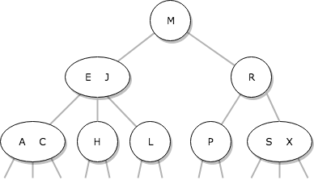
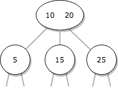
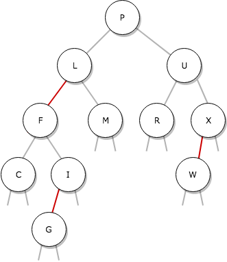
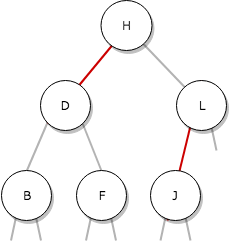
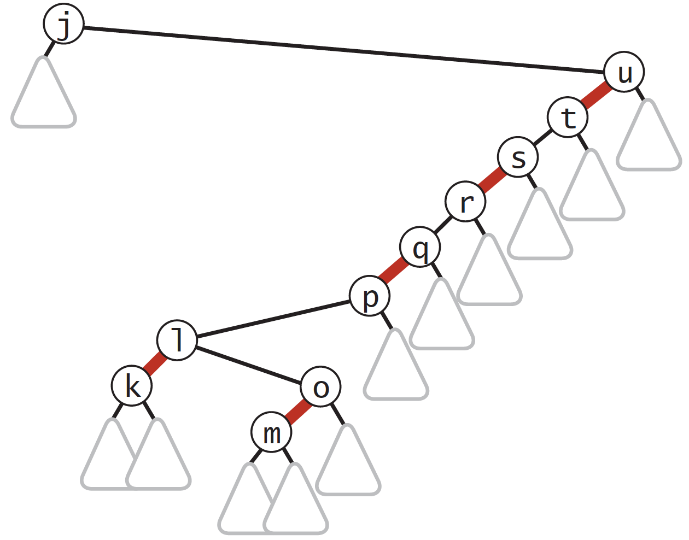

# Mandatory 1
For the course [INF102 Fall 2018](https://mitt.uib.no/courses/12780)

Deadline: Wednesday October 17, 2018 at 23:59

## Organizational notes

This assignment is an individual task, however you are encouraged to
to collaborate and discuss solutions *as long as you do not share code*
(see our policy on
[Collaboration and Cheating](https://mitt.uib.no/courses/12780/pages/collaboration-and-cheating)).
Similarily, for tasks which are not answered with code,
you may freely discuss your answers with your peers; but clearly,
blindly transcribing answers from others is not
allowed.

The assignment is graded on a scale from 0 to 100,
and accounts for 10% of your final grade.

#### Forbidden libraries

You may not use any external libraries or classes in
your answers that you did not write yourself.
The only exception to this is Kattio.java
and/or another method for fast input/output in Java; in
these cases, you should clearly mark and attribute
the code correctly. And you are still expected to be able
to explain every single line of what the code does.

You may generally use the Java standard library, but with couple of exceptions:
* Any data structure from the standard library that is used
to provide the functionality of a Collection is forbidden.
This includes (but is not limited to):
  * Set, List, Queue, Stack, Dequeue, Vector, ArrayList, LinkedList, 
 TreeSet, PriorityQueue etc.
* Any data structure from the standard library that is used to
provide the functionality of a Map is forbidden.
This includes (but is not limited to):
  * HashMap, TreeMap, Dictionary, HashTable
* Any algorithm from the standard library which implements a sort
of some kind is forbidden.
This includes (but is not limited to)
  * Arrays.sort()
  
In order to use the funcionalities offered by these data structures and algorithms,
you will need to implement them yourself. This includes any functions used for testing.
You may for instance use your own implementations from manadatory 0 and weekly exercises.

## [0]&nbsp;&nbsp;Organizational instructions (30 points)

Getting the organizational instructions right can be astonishingly difficult.
Therefore, we award a whopping 30 points to everyone who manage to follow all of them!

The number of points drop rapidly, though; for every mistake in following the handin
instructions, your points for this category is *cut in half*. Thus, if you make a single
mistake, you lose 15 points! If you make two mistakes, you lose 15 + 7.5 = 22.5 points!
So follow these instructions carefully.

#### Getting started

 * To start working with the mandatory assignment, clone or download this repository to
 your local machine. The project is in the maven format, so it should be easy to import
 to popular IDE's such as Eclipse and Intellij.
 
 (Intellij note: Before you download, go to Preferences/Settings -> Build, Execution and Deployment -> Build Tools -> Maven -> Importing and select "Import Maven projects automatically")
 * All code you write should reside in the package no.uib.ii.inf102.f18.mandatory1 (do *not* use any subpackages)
 * All code should have correct class names as according to the task specification
 
#### Register for the course at Kattis

You should already be done with this section from mandatory 0, but in case you forgot:

 * You need to register an account at Kattis *whose username is your UiB SEBRA ID*.
 For instance, if your UiB id is *abc123*, you should create a user whose username
 is also *abc123*. If you already have a Kattis user, you can change your username
 by going to settings and change it there (you can change it back after the course
 has concluded and you have received your final grade in the course).
 * At https://uib.kattis.com/courses/INF102/fall18 you should click on 
 *I am a student taking this course and I want to register for it on Kattis*, and 
 enter the keyphrase *inf102kattis*.

#### Non-code answers

 * The answer to non-code questions should be contained in a single pdf named `String.format("%s.pdf", yourid)`
 where *yourid* is your UiB SEBRA account id handle (for example, if your UiB id is *abc123*,
 you should name the file `abc123.pdf`). The file should reside in the main folder of your maven project
 (that's the same folder as this README.md).

#### Code answers

All code you write for the mandatory assignment should be added to this maven project.
If a task require you to solve a problem at Kattis, you must
submit your code to Kattis in addition to providing the code in
the project you hand in.
  *  All classes should reside in the package no.uib.ii.inf102.f18.mandatory1
  *  You will be graded on both correctness and style. Se the appendix for style
  guidelines.
  *  Be careful to name the classes correctly according to task specifications,
  or else it will count as violating the organizational instructions.

#### Submission

  * After solving the programming assignments and crafting the pdf with textual solutions,
  make a .zip file containing the main directory of your maven project.
  
    * The main directory of the zip file should be named identically to your UiB SEBRA
    account id (for example, if your UiB ID is *abc123*, then your main folder should
    also be named *abc123*).
  
    * The name of your zip file should be `String.format("%s.zip", yourid)`
 where *yourid* is your UiB SEBRA account id handle (for example, if your UiB id is *abc123*,
 you should name the file `abc123.zip`). 
 
    * To accomplish the two points above, it is easiest to copy the contents of your
    main directory to a new folder named *abc123*, and then zip that folder.
    
  * Submit the .zip file at the assignment on mitt.uib before the deadline
  
  * Late assignments will be accepted for 24 hours, with a 20 point penalty.

## [1]&nbsp;&nbsp; Quicksort (15 points)
In this task, we will examine quicksort. Subtasks (a), (b) and (c) should be answered
in the pdf, whereas subtask (d) consists of coding. In the maven project we have
provided a recursive implementation of quicksort
(in the class [Quick](src/main/java/no/uib/ii/inf102/f18/mandatory1/Quick.java)),
which you may use as a
reference. You do not need to touch this code, but you may if you want to.

 **a)** The provided quicksort implementation
is based on an in-place partitioning scheme. Show a trace of
how the partition function partitions the array `[11, 12, 4, 13, 2, 5, 11, 5, 16, 14]` (lb=0, ub=10). Give your trace in the style of [this
trace](pics/example_qs_partitioning_trace.png) (you do not need to draw the arrows, and you
may use boldface instead of color-coding if you prefer. Picture from page 291 in the book).

 **b)** Show a trace of how quicksort sorts the array `[11, 12, 4, 13, 2, 5, 11, 5, 16, 14]`, assuming
that the inital shuffle is omitted.
Give your trace in the style of [this trace](pics/example_qs_trace.png) (you may use
boldface and italics instead of color-coding if you prefer. Picture from page 289 in the book).

**c)** Much of the quicksort magic happens on lines `64` and `65` in the
[Quick](src/main/java/no/uib/ii/inf102/f18/mandatory1/Quick.java) class.
On line `64` the variable `i` is incremented until it is pointing at an
element which is greater than *or equal to* the pivot, and on line
`65`, `j` is decremented until it is pointing at an element which
is less than *or equal to* the pivot. This might seem
 counter-intuitive; but what happens if you
 instead require
`i` to point at an element which is *strictly greater* than the pivot,
and `j` to point at an element which is *strictly less* than the pivot?
Explain which bad thing happens and why. Use no more than one or two short paragraphs.

(Hint: examine what happens with the JUnit tests if you change the code
to reflect the strategy. Uncomment
the second condition on line `65` as well, otherwise
it will crash)

 **d)** The provided implementation of quicksort is recursive, but you've
 heard a rumour that iterative (non-recursive) implementations are generally quicker. Create a class
  `IterativeQuick` with a public method `sort(Comparable[] arr)`, which
  implements an 
 interative version of quicksort. Test it by modifying line `30` of [TrollBook.java](src/main/java/no/uib/ii/inf102/f18/mandatory1/TrollBook.java)
  to use your sort and solve the Kattis problem [uib.trollbook](https://uib.kattis.com/problems/uib.trollbook).
 
 (Hint: Use a stack on which you store the range you want to sort.
 Initially, push the range `[0, arr.length)` onto
 the stack; then, as long as the stack isn't empty, pop a range from
 the stack and preform the quicksort routine. Instead of doing recursive
 calls, push new ranges onto the stack.)

## [2]&nbsp;&nbsp; Priority Queues (20 points)

In this task, we will examine heap-based priority queues. Subtasks (a) and (b) should
be answered in the pdf, subtask (c) consists of coding.

**a)** The array `[ null, T, P, R, N, H, O, A, E, I, G ]` represents a
1-indexed max heap in a priority queue of type `Character`. What does
the array look like after `S` is added to the priority queue?

**b)** Criticize the following idea: To implement `peek()` (find the
 maximum/minumum) in
constant time, why not use a stack or a queue, but keep track of
the maximum/minimum value inserted so far, then return that value for
`peek()`? Limit your answer to a short paragraph.

**c)** Write a class `IndexMinPQ` which implements the interface `IIndexPQ`.

An *indexed priority queue* is one where your heap consists of *indexed* (named) items; for instance, say we have a priority queue of objects, where what you get when you peek or poll is simply the *id* of the object, and not the actual object itself. In order to know how the indices are sorted, each index (/id) is associated with a comparable *key*. The great benefit of this data structure is that it is possible to change the priority of an object if we know its index.

We have provided a (silly) class [UnorderedIndexMaxPQ](src/main/java/no/uib/ii/inf102/f18/mandatory1/UnorderedIndexMaxPQ.java)
which implements the interface. This is only for your reference; you do not
need to touch it unless you really want to.

(Hint: Use the partial solution from page 333/334 in the book as a starting point. You might need to rename some funcitons to fit the interface.)

You must fulfill the following requirements:

  * Your constructor takes a single argument, the highest allowed index in your indexed priority queue. You are *not* required to make the class dynamically resizable (and even if you do, you still need to provide such a constructor for auto-grading purposes).
  * Your `poll()` and `peek()` functions should return the index of the *minimum* element in the priority queue (as opposed to the provided [UnorderedIndexMaxPQ](src/main/java/no/uib/ii/inf102/f18/mandatory1/UnorderedIndexMaxPQ.java) class, which returns the index of the maximum).
  * Your `add()`, `delete()`, `changeKey()` and `poll()` functions should take logarithmic time at worst (as a function of the number of elements currently in the priority queue)
  * Your `peek()`, `contains()`, `size()`, and `getKey()` functions should take constant time.

## [3]&nbsp;&nbsp; Binary Search Tree (15 points)

In this problem, we examine binary search trees (BST's). Subtask (a) should be answered in the pdf, whereas subtasks (b), (c) and (d) consists of code. We have included the binary search tree from lecture in the class [BinarySearchTree](src/main/java/no/uib/ii/inf102/f18/mandatory1/BinarySearchTree.java). You will change this code as part of subtask (b) and (c).

Subtask (a) require a drawing of a tree; we will not judge you by its artistic quality, as long as it is easy to understand. In particular, the root should be on the top, and all nodes at the same distance from the root should be vertically aligned (see examples later in the assignment). There is a nice tool for drawing trees at [draw.io](https://www.draw.io) (however, we also accept pictures of your notebook). Note: Drawing the "null" edges is important. You will lose points if you don't draw them.

**a)** Draw the BST that results you insert the keys `Z M Q N Y I D S B F T` in that order into an initially empty tree.

**b)** Change the `get(Key key)` function to become iterative (non-recursive).

**c)** The provided BST is violating the rules of the assignment in that its `keys()` method is actually returning an `ArrayDeque` from the Java standard
library. Fix it by using a stack or a queue you have written yourself instead, which
implements `Iterable`.

**d)** Create a class `BSTDebugging` which solves the Kattis problem [uib.bstdebugging](https://uib.kattis.com/problems/uib.bstdebugging).

## [4]&nbsp;&nbsp; Balanced Binary Search Trees (20 points)

All answers to this section should be answered in the pdf. Some questions may require drawings of trees; we will not judge you by their artistic quality, as long as they are easy to understand. In particular, the root should be on the top, and all nodes at the same distance from the root should be vertically aligned (see examples below). There is a nice tool for drawing these bad boys at [draw.io](https://www.draw.io) (however, we also accept pictures of your notebook).

Note: Drawing the "null" edges is important. You will lose points if you don't draw them.

 **a)** Draw the 2-3 tree that results when you insert the keys `Z M Q N Y I D S B F T` in that order into an initially empty tree
 
 **b)** Find an insertion order for the keys `T F B S D I Y N` that leads to a 2-3 tree of height 1.
 
 **c)** Which of the following are red-black BSTs? 

 **d)** A left-leaning red-black BST is a particular implementation of 2-3 trees, and there is a bijection between illustrations of left-leaning red-black BST's and a 2-3 trees. Fill in the table below with the missing pictures.
 
 Task | 2-3 tree | Red-black BST
 ---- | -------- | -------------
   i  |  | 
  ii  |  |  
  iii |   | 
  iv  |   | 
  v   |   |

 **e)** In the left-leaning red-black implementation of 2-3 trees, we use three operations: "rotate left," (L) "rotate right" (R) and "flip colors" (F). For the red-black tree below, give the order that these operations are applied when the character `n` is inserted (only the search path is shown). Give your trace as a single string with the characters L, R and F.
 
 
 
 **f)** What is the maximum depth of a left-leaning red-black tree with `n` nodes? Explain/prove your answer.

 
 ##### Good luck!
 
 
### Appendix: Style Guide
 
These rules applies to all source code that is handed in. These guidelines are loosely based on [Google Java Style Guide](https://google.github.io/styleguide/javaguide.html), though with some minor differences.

##### Most important
  * Make your code easy to read.
    * Comment tricky parts of the code.
    * Use descriptive and logical variable names and function names.
    * Break the code into appropriate functions for readablity and code reuse; no function should ideally be more than 30 lines of code (with the exception of extremely monotone code, such as sanity tests).
    * Write javadoc comments for functions that are not self-explanatory
  * All files should use UTF-8 character encoding.
  
##### Also important
  * The only whitespace characters allowed are spaces and newlines (tabs are not allowed).
    * Each indention level increase by 4 spaces.
  * No line may exceed 120 characters - lines exceeding this limit must be line-wrapped.
    * Some exceptions, e.g. very long URL's that don't fit on one line.
  * File name should be the same as the name of the class, written in UpperCamelCase.
  * Function names, parameter names and variable names should be written in lowerCamelCase.
  * Constants should be written in ALL_CAPS.
  * No line breaks before open braces (`{`).
  * Blank lines should be used sparingly, but can be used to separate logic blocks and increase readability
  
